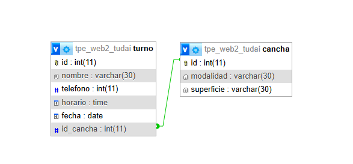

# Turno Padel

### Integrantes:
- Valentino Moretti (tinomoretti1@gmail.com)
- German Hernandez (germanhernandez2006@gmail.com)

### Tematica:
- Nuestro proyecto se trata sobre una base de datos para sacar turnos de cancha de padel.

### Descripcion: 
- Este modelo de base de datos representa la gestión de turnos para canchas de padel. Consta de dos tablas principales: cancha y turno. La tabla cancha almacena la información de cada cancha disponible, como su modalidad (por ejemplo, pádel) y la superficie en la que se juega. Por su parte, la tabla turno guarda los datos de cada reserva realizada por un cliente, incluyendo su nombre, teléfono de contacto, la fecha y el horario del turno.
Ambas tablas están vinculadas mediante el campo id_cancha, que actúa como clave foránea en turno y referencia al identificador único de la cancha. De esta manera, se establece una relación de uno a muchos (1:N), ya que una cancha puede tener varios turnos asociados en distintas fechas y horarios, mientras que cada turno pertenece siempre a una única cancha.

### DER:
-  

### SQL:
- [CODIGO SQL](turnos_padel.sql)